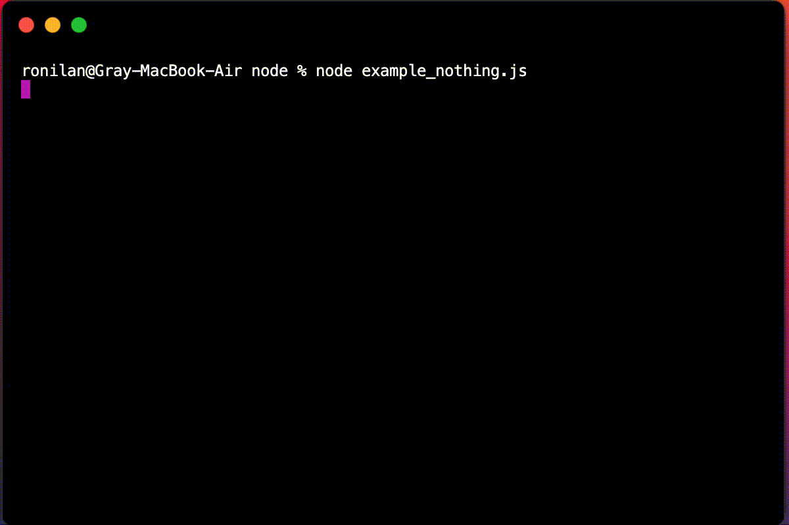
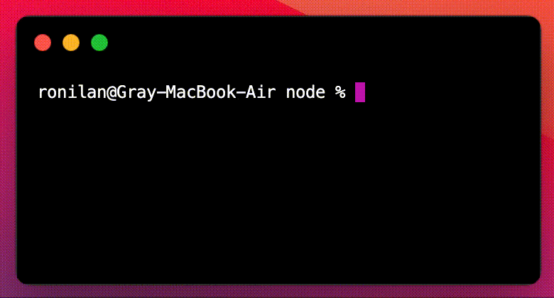
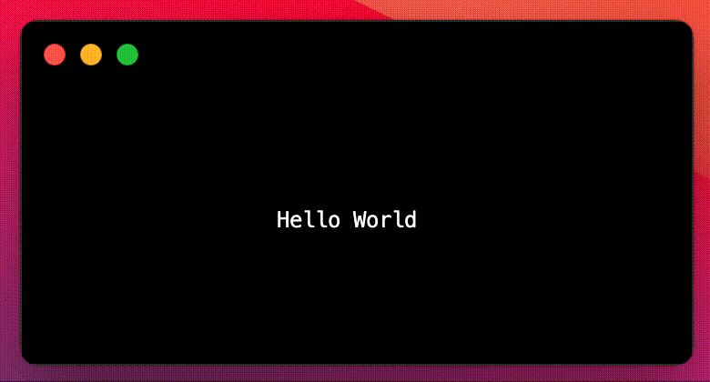
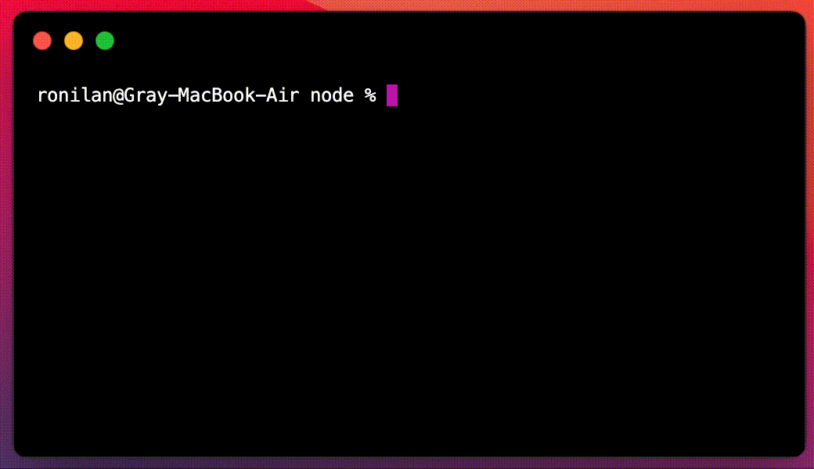
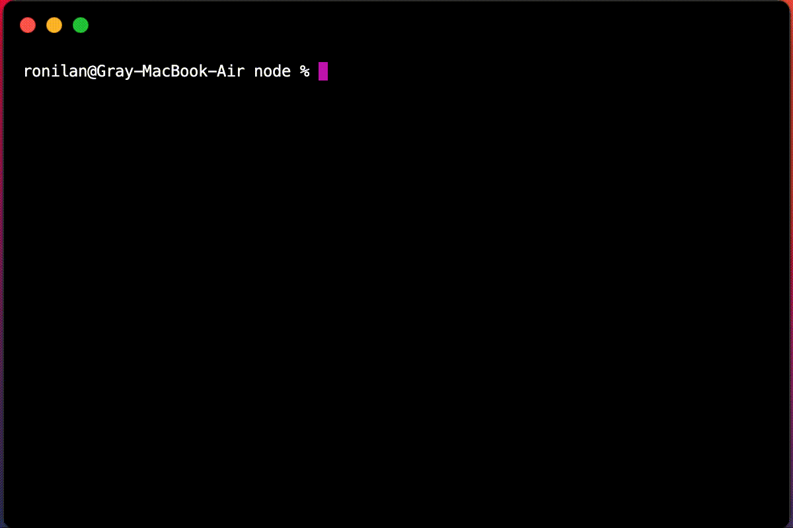

# What is Impossible?

> Nothing is impossible, the word itself says "I'm possible"!</br>
                                          *-- Audrey Hepburn*

 

## **Now Seriously, What is Impossible?**

Impossible.js is an Object Oriented JavaScript library for building cross-platform terminal apps (and games). It lets you compose complex user interfaces from small and isolated components, thus greatly simplifying the creation of terminal apps. 

Impossible apps and games are bundles with no dependencies, installed via [npm](https://www.npmjs.com/search?q=keywords:Impossible). They are fore and foremost Node.js apps meant to be used in the terminal, but they can also be "built" and run the browser with similar functionality and (mostly) identical UI.

 

Impossible.js is written from scratch. It has no dependencies (other than stable [timsort](https://www.npmjs.com/package/timsort)). It is based on modern JavaScript features and specifically relies on extending classes as the basic building block. It implements a DOM like component tree structure and a theming engine with similarities to CSS. 

The API design is original (i.e. not "inspired by" React, ncurses or other). Some of the implementation concepts are novel. Both inheritance and composition are used, and in the case of both patterns, there is something unique. 

Apps can run be written to function in either "full screen" mode (TUI) or "inline" mode (CLI).

  

# Project Overview

The project provides two development libraries `impossible` and `impossible-collection`, each containing multiple components which are also available as standalone packages for production builds, an app Repo Template, a tutorial and multiple example apps and games.

### Development Packages

* [Impossible Core](https://www.npmjs.com/package/impossible) (and build time replacement [Impossible Web](https://www.npmjs.com/package/impossible-web))
* [Impossible Collection](https://www.npmjs.com/package/impossible-collection)

## Impossible Core

The core library provides three classes `Stage`, `Sprite` and `Look` from which all components (and eventual apps) are built.

### Hello World

The simplest Impossible example looks like this:

```javascript
import { Stage, Sprite, Look } from 'impossible'

new Stage()

new Sprite({ 
  look: new Look(`Hello World`)
}).toCenter()
```

It displays Hello World at the center of the terminal screen.



Creating a reusable `Hello` component and then using it to achieve same result is done in the following manner:

```javascript
import { Stage, Sprite, Look } from 'impossible'

class Hello extends Sprite {
  constructor (props = {}) {
    super(props)

    this.look = new Look('Hello World')
    this.toCenter()
  }
}

new Stage()

new Hello()
```

### Component Packages

* [Stage](https://www.npmjs.com/package/@impossible.js/stage)
* [Sprite](https://www.npmjs.com/package/@impossible.js/sprite)
* [Look](https://www.npmjs.com/package/@impossible.js/look)
* [Stage-Web](https://www.npmjs.com/package/@impossible.js/stage-web) (build time replacement)

## Impossible Collection

Collection components are composite components that extend `Sprite` (and/or each other). They provide functionality similar to that provided by native controls in the browser and can be used as building blocks for user defined components to speed up development.

### Hello World

Example using the `Marquee` component:

```javascript
import { Stage } from 'impossible'
import { Marquee } from 'impossible-collection'

new Stage()

new Marquee({ 
  text: `Hello World`
}).toCenter()
```
It displays an old school endlessly scrolling Hello World at the center of the terminal screen.


Using the `TextInput` component:

```javascript
import { Stage } from 'impossible'
import { TextInput } from 'impossible-collection'

new Stage()

new TextInput({ 
  text: `Hello World`,
  border: true
}).toCenter()
```
Will display text input box.


Using the `ColorPicker` component:

```javascript
import { Stage } from 'impossible'
import { ColorPicker } from 'impossible-collection'

new Stage()

new ColorPicker().toCenter()
```

Will display a color picker component.



### Component Packages

* [Alert](https://www.npmjs.com/package/@impossible.js/alert)
* [Animated](https://www.npmjs.com/package/@impossible.js/animated)
* [Blink](https://www.npmjs.com/package/@impossible.js/blink)
* [Box](https://www.npmjs.com/package/@impossible.js/box)
* [BoxedText](https://www.npmjs.com/package/@impossible.js/boxed-text)
* [Boxable](https://www.npmjs.com/package/@impossible.js/boxable)
* [Button](https://www.npmjs.com/package/@impossible.js/button)
* [CancelButton](https://www.npmjs.com/package/@impossible.js/cancel-button)
* [Checkbox](https://www.npmjs.com/package/@impossible.js/checkbox)
* [ColorPicker](https://www.npmjs.com/package/@impossible.js/color-picker)
* [Combobox](https://www.npmjs.com/package/@impossible.js/combobox)
* [Confirm](https://www.npmjs.com/package/@impossible.js/confirm)
* [Container](https://www.npmjs.com/package/@impossible.js/container)
* [Dropdown](https://www.npmjs.com/package/@impossible.js/dropdown)
* [DynamicBody](https://www.npmjs.com/package/@impossible.js/dynamic-body)
* [Editable](https://www.npmjs.com/package/@impossible.js/editable)
* [Entity](https://www.npmjs.com/package/@impossible.js/entity)
* [Form](https://www.npmjs.com/package/@impossible.js/form)
* [HorizontalLine](https://www.npmjs.com/package/@impossible.js/horizontal-line)
* [HorizontalList](https://www.npmjs.com/package/@impossible.js/horizontal-list)
* [Input](https://www.npmjs.com/package/@impossible.js/input)
* [Logo](https://www.npmjs.com/package/@impossible.js/logo)
* [Marquee](https://www.npmjs.com/package/@impossible.js/marquee)
* [NumberInput](https://www.npmjs.com/package/@impossible.js/number-input)
* [PasswordInput](https://www.npmjs.com/package/@impossible.js/password-input)
* [Pixel](https://www.npmjs.com/package/@impossible.js/pixel)
* [Prompt](https://www.npmjs.com/package/@impossible.js/prompt)
* [Radio](https://www.npmjs.com/package/@impossible.js/radio)
* [Rectangle](https://www.npmjs.com/package/@impossible.js/rectangle)
* [Screen](https://www.npmjs.com/package/@impossible.js/screen)
* [Select](https://www.npmjs.com/package/@impossible.js/select)
* [Selectable](https://www.npmjs.com/package/@impossible.js/selectable)
* [Sensor](https://www.npmjs.com/package/@impossible.js/sensor)
* [StaticBody](https://www.npmjs.com/package/@impossible.js/static-body)
* [SubmitButton](https://www.npmjs.com/package/@impossible.js/submit-button)
* [TabbedItem](https://www.npmjs.com/package/@impossible.js/tabbed-item)
* [TabbedWindow](https://www.npmjs.com/package/@impossible.js/tabbed-window)
* [Text](https://www.npmjs.com/package/@impossible.js/text)
* [TextArea](https://www.npmjs.com/package/@impossible.js/text-area)
* [TextInput](https://www.npmjs.com/package/@impossible.js/text-input)
* [Typewriter](https://www.npmjs.com/package/@impossible.js/typewriter)
* [VerticalLine](https://www.npmjs.com/package/@impossible.js/vertical-line)
* [VerticalList](https://www.npmjs.com/package/@impossible.js/vertical-list)
* [Window](https://www.npmjs.com/package/@impossible.js/window)


### Functional Packages

* [Bounding](https://www.npmjs.com/package/@impossible.js/helpers-bounding)
* [Rectangles](https://www.npmjs.com/package/@impossible.js/helpers-rectangles)
* [Environment](https://www.npmjs.com/package/@impossible.js/helpers-environment)
* [Errors](https://www.npmjs.com/package/@impossible.js/helpers-errors)
* [Prototype](https://www.npmjs.com/package/@impossible.js/helpers-prototype)
* [Styling](https://www.npmjs.com/package/@impossible.js/helpers-styling)
* [ANSI 256 Converter](https://www.npmjs.com/package/@impossible.js/utils-ansi-256-converter)
* [ANSI Decorator](https://www.npmjs.com/package/@impossible.js/utils-ansi-decorator)


## Impossible App Repo Template

The [Impossible App Repo Template](https://github.com/ronilan/impossible-template) is designed to ease the way into creating Impossible apps. It contains the required directory structure and webpack Babel configurations used to build apps that run in both the terminal and the browser.

## Impossible Tutorial

The [Impossible Tutorial repo](https://github.com/ronilan/impossible-tutorial) uses Impossible to build several versions of an interactive Tic-Tac-Toe game. As the tutorial iterates through various ways in which such a game can be built it will also explores basic Impossible concepts and patterns as well as discusses how things work under the hood.

 

## Impossible Demo Apps and Games

### Example Games

#### Impossible Solitaire

Impossible Solitaire is a terminal (and web) based version of the classic card game (and Windows 3.x app). Play is mouse driven. Drag-and-Drop, Click and Double Click all work where appropriate. Game board is always centered and is also responsive. Game has multiple options and 5 color themes.

 

See also: https://github.com/ronilan/impossible-solitaire-demo

#### Impossible Snaky

Impossible Snaky is a terminal (and web) based version of the classic Nokia Phone game Snake, with some added features. There are 5 different games to play which introduce obstacles and other snakes.

 

#### Impossible Flappy

Impossible Flappy is a terminal (and web) based version of the classic iOS app with some new twists. There are 3 different games to play. Some are fun and some are just a little strange.


 

### Example Apps

#### Impossible Todo

Impossible Todo is a terminal based task tracking app a-la the web based [TodoMVC](https://todomvc.com/) apps.

 

#### Impossible Hacker News

A terminal based Hacker News (news.ycombinator.com) reader.

 

#### IMPO

IMPO, the Impossible Editor, is a simple, multi file, resizable, node based, code editor, with mouse support.


 

# Authors

(c) [Ron Ilan](https://www.ronilan.com)

# License

[NOT LICENSED](./LICENSE.md)

###### Fabriqué au Canada : Made in Canada 🇨🇦
